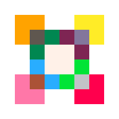

<p align="center">
  
</p>

# Runty8

A Pico8 clone in Rust.

## Making your own games

Head over to our [template](https://github.com/jjant/runty8-game-template) for an example to get started!

## Crates

* `runty8`: Main entry point for games created with Runty8. Most Runty8 users should probably only depend on this crate.
* `runty8-core`: Core types needed by every Runty8 related crate
* `runty8-runtime`: Run standalone Runty8 games in `native` or `wasm` targets
* `runty8-editor`: Run game inside editor
* `runty8-winit`: Integration layer for `winit`
* `runty8-event-loop`: Thin layer over `winit`/`glow`/`glutin` to have a cross-platform OpenGL/WebGL-powered event loop

## Contributing

See [the contributing guide](./CONTRIBUTING.md) for instructions on how to get started.

## Examples

<p align="center">
  <a href="./examples/celeste/main.rs">
    
  </a>
</p>

- [Celeste](./examples/celeste/main.rs): A Rust port of Maddy Thorson and Noel Berry's [Celeste](https://www.lexaloffle.com/bbs/?tid=2145)
- [Confetti mouse demo](./examples/confetti/main.rs)
- [Moving box](./examples/moving-box/main.rs)

## Running

Run examples (`celeste`, `moving_box`, `confetti`) with:

```bash
cargo run --bin celeste -- --game
cargo run --bin confetti -- --game
cargo run --bin moving-box -- --game
```

Or run `cargo run --bin` to get a list of the available examples.

Press the `Escape` key to switch between the game and the editor.

